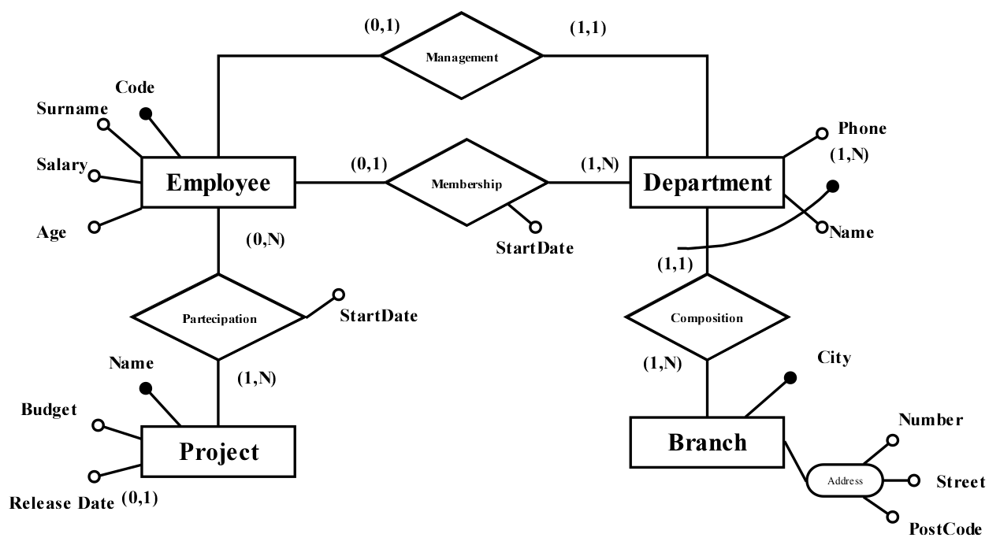

# Translation of E/R diagram to relational schema
Come esempio abbastanza esaustivo di traduzione di una schema E/R (già ristrutturato eliminando le specializzazioni/genralizzazioni) si procede alla traduzione dello schema E/R di seguito riportato:

Un'ultimo passo di ristrutturazione potrebbe consistere nel trasformare l'attributo multiplo Phone in un'entità collegata da un'associazione 1:N cui Department partecipa con cardinalità 1:N e Phone con cardinalità 1:1.

Detto questo, i passi da compiere sono in generale:
* traduzione entità
* traduzione associazioni N:M
* traduzione associazioni 1:N e attributi multipli (trasformati come sopra)
* traduzione associazioni 1:1
* eventuali ottimizzazioni/varianti

## Traduzione delle entità
Le entità danno origine ad una tabella, tipicamente con lo stesso nome dell'entità, avente come colonne gli attributi (non multipli) dell'entità.
> In questa fase si possono ignorare le associazione cui l'entità partecipa e tradurle successivamente.

Nel nostro caso, per l'entità *Project*:
```SQL
CREATE TABLE project (
    -- primary key field(s)
    name VARCHAR(30) COMMENT "Nome",
    -- mandatory fields
    budget DECIMAL(10,2) NOT NULL COMMENT "Budget up to 99.999.999,99",
    -- optional fields (NULL can be omitted)
    release_date DATE NULL DEFAULT NULL COMMENT "Data di rilascio",
    -- CONSTRAINTS:
    -- PRIMARY KEY: implies NOT NULL
    PRIMARY KEY (name),
    -- DOMAIN (optional)
    CHECK(budget > 0.00)
) COMMENT "Table for entity Project";
```

Per l'entità *Branch*:
```SQL
CREATE TABLE branch (
    -- primary key field(s)
    city VARCHAR(30) COMMENT "city",
    -- mandatory fields
    number VARCHAR(10) NOT NULL COMMENT "number",
    street VARCHAR(30) NOT NULL COMMENT "street",
    postcode VARCHAR(5) NOT NULL COMMENT "postcode",
    -- CONSTRAINTS:
    -- PRIMARY KEY: implies NOT NULL
    PRIMARY KEY (city)
) COMMENT "Table for entity Branch";
```

Per l'entità *Employee*:
```SQL
CREATE TABLE employee (
    -- primary key field(s)
    code INT AUTO_INCREMENT COMMENT "matricola",
    -- mandatory fields
    surname VARCHAR(30) NOT NULL COMMENT "surname",
    salary DECIMAL(8,2) NOT NULL COMMENT "salary",
    birthdate DATE NOT NULL COMMENT "nascita",
    -- derived (computed) fields
    age INT AS (DATEDIFF(NOW(), birthdate) / 365) VIRTUAL COMMENT "age wrongly computed...",
    -- CONSTRAINTS:
    -- PRIMARY KEY: implies NOT NULL
    PRIMARY KEY (code)
) COMMENT "Table for entity Employee";
```

Per l'entità *Department*:
```SQL
CREATE TABLE department (
    -- primary key field(s)
    name VARCHAR(20) COMMENT "Department name",
    branch VARCHAR(30) COMMENT "city branch",
    -- CONSTRAINTS:
    -- PRIMARY KEY: implies NOT NULL
    PRIMARY KEY (name, branch),
    -- FOREIGN KEYS (optional)
    CONSTRAINT PartOfBranch FOREIGN KEY(branch) REFERENCES branch(city)
        ON UPDATE CASCADE ON DELETE NO ACTION
) COMMENT "Table for entity Department";
```

> In questo caso, poichè l'entità Department utilizza come parte del suo identificatore quello della Branch con la quale partecipa (1 e 1 sola volta) all'associazione Composition, si è inserito tale identificatore (con nome branch anziché city) nella tabella e si è aggiunto il vincolo di chiave esterna con riferimento al campo city della tabella branch.
> 
> Si noti che questo è un caso particolare di traduzione di un'associazione 1:N, nel quale la chiave primaria dell'entità che partecipa con cardinalità massima N, inserita come chiave esterna nella tabella dell'entità che partecipa con cardinalità massima 1, diventa parte della chiave primaria di quest'ultima.

Per l'entità *Phone*:
```SQL
CREATE TABLE phone (
    -- primary key field(s)
    number VARCHAR(10) COMMENT "phone number",
    department VARCHAR(20) COMMENT "Department name",
    branch VARCHAR(30) COMMENT "department city branch",
    -- CONSTRAINTS:
    -- PRIMARY KEY: implies NOT NULL
    PRIMARY KEY (number, department, branch), -- if a number can be shared between departments
    -- PRIMARY KEY (number), -- if a number is unique to a department
    -- FOREIGN KEYS (optional)
    CONSTRAINT BelongsToDepartment FOREIGN KEY(department, branch) REFERENCES department(name, branch)
        ON UPDATE CASCADE ON DELETE NO ACTION
) COMMENT "Table for multiple attribute Phone of entity Department";
```

> Anche in questo caso, poichè l'entità Phone utilizza come parte del suo identificatore quello del Department con il quale partecipa (1 e 1 sola volta) all'associazione di attributo multiplo, si è inserito tale identificatore (con nomi department e branch anziché name e branch) nella tabella e si è aggiunto il vincolo di chiave esterna (**unico**!!!) con riferimento ai campi name e branch della tabella department.

## Traduzione delle associazioni N:M
Le associazioni N:M danno origine ad una ulteriore tabella, tipicamente con lo stesso nome dell'associazione, avente come colonne le chiavi primarie delle entità partecipanti (con il rispettivo vincolo di chiave esterna) e gli attributi propri dell'associazione.

Le associazioni N:M danno origine ad una ulteriore tabella, tipicamente con lo stesso nome dell'associazione, così composta:
1. chiave primaria dell'entità 1 (con vincolo di FOREIGN KEY)
2. chiave primaria dell'entità 2 (con vincolo di FOREIGN KEY)
3. eventuali attributi identificanti dell'associazione
4. eventuali altri attributi dell'associazione (possibilmente NULL se opzionali)

La chiave primaria della tabella è costituita dall'insieme di 1., 2. e 3., ovvero dall'insieme delle chiavi esterne ed eventuali attributi identificanti dell'associazione.

> Questo è un caso generale a cui si possono ricondurre quelli delle associazioni 1:N e 1:1.

Nel nostro caso, per l'associazione *Partecipation*:
```SQL
CREATE TABLE partecipation (
    -- primary key field(s)
    employee INT COMMENT "1. Partecipating employee code",
    project VARCHAR(30) COMMENT "2. Project name",
    -- mandatory fields
    start DATE NOT NULL COMMENT "4. Starting date",
    -- CONSTRAINTS:
    -- PRIMARY KEY: implies NOT NULL
    PRIMARY KEY (employee, project),
    -- FOREIGN KEYS (optional)
    CONSTRAINT RealEmployee FOREIGN KEY(employee) REFERENCES employee(code)
        ON UPDATE CASCADE ON DELETE NO ACTION,
    CONSTRAINT RealProject FOREIGN KEY(project) REFERENCES project(name)
        ON UPDATE CASCADE ON DELETE NO ACTION
) COMMENT "Table for association Partecipation";
```

In questo caso l'attributo *start* non è identificante e quindi non entra a far parte della chiave primaria.

Se invece l'attributo avesse, ad esempio, il significato di "data in cui l'employee ha svolto un'attività per il progetto" allora sarebbe identificante (il medesimo employee può svolgere diverse attività in giorni *diversi* per il medesimo progetto) ed entrerebbe a far parte della chiave primaria (che sarebbe quindi: ```PRIMARY KEY (employee, project, start)```).

## Traduzione delle associazioni 1:N
Le associazioni 1:N, come già visto, non danno necessariamente origine ad una ulteriore tabella, anche se questa possibilità può essere presa in considerazione per casi particolari.

Tipicamente esse sono tradotte inserendo come chiave esterna, nella tabella dell'entità che partecipa con cardinalità massima 1:
1. chiave primaria dell'entità che partecipa con cardinalità massima N (con vincolo di FOREIGN KEY)
2. eventuali attributi (necessariamente non identificanti) dell'associazione

Se la cardinalità (per l'entità nella cui tabella è inserita la chiave esterna) è 0:1 (partecipazione opzionale) sia la chiave esterna che gli eventuali attributi divengono opzionali.

Può essere opportuno inserire dei vincoli aggiuntivi affinchè tutti gli attributi inseriti siano NULL o non lo sia nessuno.

Nel nostro caso, per l'associazione *Membership*:
```SQL
ALTER TABLE employee
    ADD COLUMN department VARCHAR(20) NULL COMMENT "1. Member of Department name",
    ADD COLUMN branch VARCHAR(30) NULL COMMENT "1. Member Department branch",
    ADD COLUMN start DATE NULL COMMENT "2. Membership start date",
    -- CONSTRAINTS:
    ADD CONSTRAINT membershipDepartment FOREIGN KEY(department, branch) REFERENCES department(name, branch)
        ON UPDATE CASCADE ON DELETE NO ACTION,
    -- OPTIONAL FOREIGN KEY MEANINGFUL: (both NULL or none NULL)
    ADD CONSTRAINT DepartmentBranchNULLS CHECK(department IS NULL = branch IS NULL),
    -- Optional Relationship mandatory attribute MEANINGFUL: (NULL if no partecipation)
    ADD CONSTRAINT NoStarDateIfNoMembership CHECK(department IS NULL = start IS NULL);
```
Naturalmente si può, in generale, inserire i campi ed i vincoli direttamente in fase di creazione della tabella.

Una strada alternativa, in alcuni casi più efficiente o conveniente, è quella di creare comunque una tabella aggiuntiva, così composta:
1. chiave primaria dell'entità che partecipa con cardinalità massima 1 (con vincolo di FOREIGN KEY)
2. chiave primaria dell'entità che partecipa con cardinalità massima N (con vincolo di FOREIGN KEY)
3. eventuali attributi (necessariamente non identificanti) dell'associazione

La chiave primaria della tabella è costituita soltanto da 1., ovvero dalla chiave primaria dell'entità con partecipazione singola.

Questa scelta può risultare migliore quando:
* l'associazione è poco utilizzata (poche operazioni non frequenti);
* la percentuale di istanze che partecipano è limitata.

Nel nostro caso, per l'associazione *Membership*:
```SQL
CREATE TABLE membership (
    -- primary key field(s)
    employee INT COMMENT "1. Member employee code",
    -- foreign key field(s)
    department VARCHAR(20) COMMENT "2. Department name",
    branch VARCHAR(30) COMMENT "2. city branch",
    -- mandatory fields
    start DATE NOT NULL COMMENT "Starting date",
    -- CONSTRAINTS:
    -- PRIMARY KEY: implies NOT NULL
    PRIMARY KEY (employee),
    -- FOREIGN KEYS (optional)
    CONSTRAINT RealMember FOREIGN KEY(employee) REFERENCES employee(code)
        ON UPDATE CASCADE ON DELETE NO ACTION,
    CONSTRAINT MemberOfDepartment FOREIGN KEY(department, branch) REFERENCES department(name, branch)
        ON UPDATE CASCADE ON DELETE NO ACTION
) COMMENT "Table (not really needed) for relationship Membership between entities Employee and Department";
```

## Traduzione delle associazioni 1:1
Le associazioni 1:1, come già visto per le 1:N, non danno necessariamente origine ad una ulteriore tabella, anche se questa possibilità può essere presa in considerazione per casi particolari.

Tipicamente esse sono tradotte inserendo come le associazioni 1:N, scegliendo quale entità considerare come lato 1, ed aggiungendo un vincolo di unicità per la chiave esterna inserita.

Tipicamente si sceglierà per l'inserimento l'entità con partecipazione obbligatoria, oppure quella con la chiave primaria più complessa.

Scelta l'entità in cui aggiungere colonne e vincoli, si inseriscono:
1. chiave primaria dell'altra entità (con vincolo di FOREIGN KEY e UNIQUE)
2. eventuali attributi (necessariamente non identificanti) dell'associazione

Se la cardinalità (per l'entità nella cui tabella è inserita la chiave esterna) è 0:1 (partecipazione opzionale) sia la chiave esterna che gli eventuali attributi divengono opzionali.

Può essere opportuno inserire dei vincoli aggiuntivi affinchè tutti gli attributi inseriti siano NULL o non lo sia nessuno.

Nel nostro caso, per l'associazione *Management*, visto che:
* la partecipazione di Department è obbligatoria mentre quella di Employee è facoltativa
* la chiave di Department è composta da due attributi alfanumerici mentre quella di Employee è composta da un solo attributo intero

risulta conveniente inserire la chiave di employee all'interno della tabella di department:
```SQL
ALTER TABLE department
    ADD COLUMN manager INT NOT NULL COMMENT "1. Manager employee code",
    -- CONSTRAINTS:
    ADD CONSTRAINT RealManager FOREIGN KEY(manager) REFERENCES employee(code)
        ON UPDATE CASCADE ON DELETE NO ACTION,
    ADD CONSTRAINT OnlyOneDepartmentPerManager UNIQUE(manager);
```

## Final script
Here's the final script [Company-schema](company/Company-schema.sql)
